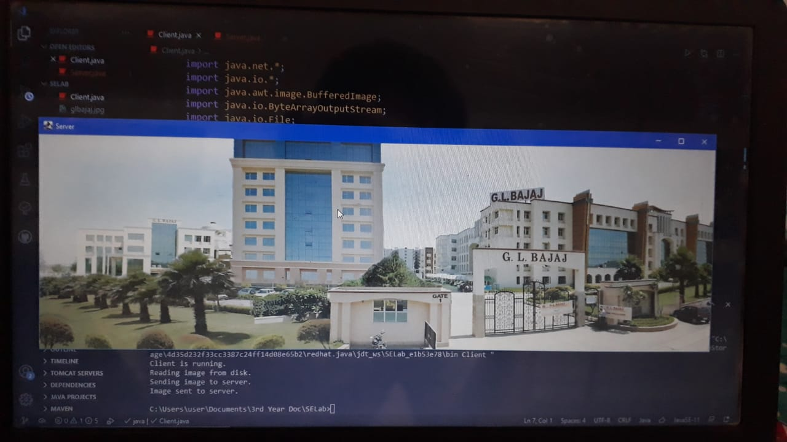

## Program: Create a socket for HTTP for web page upload and download.
# Output:

>Source: [Darkwebcode](https://www.darkwebcode.com/2020/04/create-socket-for-http-for-web-page-upload-and-download.html)